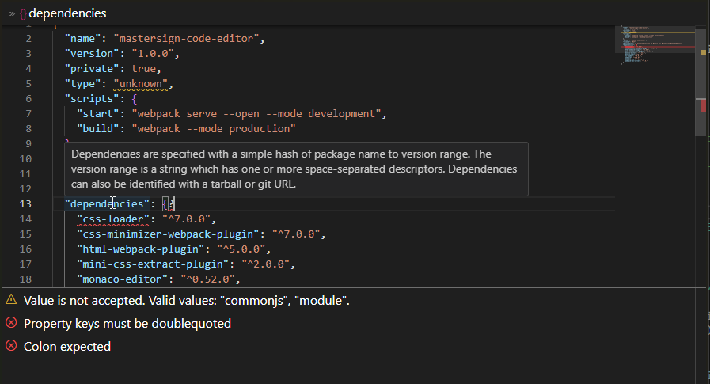

# Mastersign WPF Code Editor Control


> WPF control for editing JSON and YAML with syntax highlighting and JSON schema support



## Intention

This control is intended to be used as a powerful editor for
data structures in a WPF application.
The main goal is to provide a YAML and JSON editor with JSON schema support.
With this capability it is well suited for editing configuration files and data models.

It is supposed to support editing individual files without further context.

It is designed to run on modern Windows 11 systems without additional setup.

## Background

The control makes use of the Monaco editor from Visual Studio Code,
bundeled with the `monaco-yaml` plug-in.
The Monaco editor is rendered in WebView2.
Which is an embedded instance of a specially configured version of the Microsofts Edge browser.

This stack is optimized for the reuse of resources.
WebView2 usually makes use of the Edge browser installed with Windows.
And even if multiple instances of the Mastersign WPF Code Editor Control
are displayed, in the background only one instance of the Edge browser engine is running.
Every instance of the Mastersign WPF Code Editor Control is comparable
with a tab in the Edge browser in regard to resource consumption.

## Limitations

Editing code for programming is not well supported.
This is due to the fact, that the control does not load a project context or fully featured language server.
It is focused on editing structural data files.

The control currently does not support property binding for the edited text.
That is due to the fact, that data exchange with Monaco is performed asynchronously.

## Requirements

The control targets .NET Framework 4.8, which is installed by default
on Windows 10 and Windows 11.

The control makes use of WebView2 and expects the WebView2 runtime to be installed on the system.
For current Windows 11 systems, and even the most Windows 10 systems, this is given.
On older Windows 10 systems the WebView2 runtime can be installed manually.

## Usage

Add the NuGet package `Mastersign.WpfCodeEditor` as a dependency to your WPF project.

Put the XML namespace `xmlns:ce="clr-namespace:Mastersign.WpfCodeEditor;assembly=Mastersign.WpfCodeEditor"` into your parent window or page.

Then use `<ce:CodeEditor>` to place the code editor in your XAML.

You can configure the editor with an instance of `CodeEditorConfiguration`.
If you decide to the change the `CodeEditor.Configuration` in the code behind file, it might be necessary to call `CodeEditor.Reinitialize()` to apply the changed configuration.

Use the `CodeEditor.EditorReady` event to get notified
when Monaco is loaded and initialized.

```xml
<Window x:Class="Demo.MainWindow"
        xmlns="http://schemas.microsoft.com/winfx/2006/xaml/presentation"
        xmlns:x="http://schemas.microsoft.com/winfx/2006/xaml"
        xmlns:mc="http://schemas.openxmlformats.org/markup-compatibility/2006"
        xmlns:ce="clr-namespace:Mastersign.WpfCodeEditor;assembly=Mastersign.WpfCodeEditor"
        Title="Mastersign WPF Code Editor Control Demo"
        Height="600" Width="800">

    <Grid>
        <Grid.RowDefinitions>
            <RowDefinition Height="Auto" />
            <RowDefinition />
        </Grid.RowDefinitions>

        <Button x:Name="btnGetText"
                Click="btnGetText_Click">
            Get Text
        </Button>

        <ce:CodeEditor x:Name="codeEditor"
                       EditorReady="codeEditor_Ready">
            <ce:CodeEditor.Configuration>
                <ce:CodeEditorConfiguration
                    EnableSchemaRequests="True"
                    ShowBreadcrumbs="True"
                    ShowCodeMarkers="True"
                    CodeMarkersHeight="20vh"
                    LineNumbers="On"
                    VerticalScrollbar="Visible"
                    HorizontalScrollbar="Auto"
                    MinimapSide="Right"
                    MinimapAutohide="False"
                    MinimapShowSlider="Always"
                    />
            </ce:CodeEditor.Configuration>
        </ce:CodeEditor>
    </Grid>
</Window>
```

To load a custom JSON schema, use the asynchronous method
`CodeEditor.LoadJsonSchemaAsync(string schema, string uri)`.

To load your code into the editor, use the asynchronous method
`CodeEditor.LoadText(string text, CodeLanguage language, string filename)`.
The language is used by Monaco to activate syntax highlighting and schema validation.
The filename is considered by the schema validator to
automatically select a JSON schema.
E.g. the NodeJS package definition schema for `package.json`.

To retrieve the currently edited text from the editor control,
use the asynchronous method `CodeEditor.GetTextAsync()`.

These methods are asynchronous, because WebView2 is using
inter-process communication in the background,
to exchange data with the Edge browser process, rendering Monaco.

```cs
using System;
using System.Windows;

namespace Demo;

public partial class MainWindow : Window
{
    public MainWindow()
    {
        InitializeComponent();
    }

    private async void codeEditor_Ready(object sender, EventArgs e)
    {
        await codeEditor.LoadJsonSchemaAsync(
            """
            {
              "$id": "https://example.com/address.schema.json",
              "$schema": "https://json-schema.org/draft/2020-12/schema",
              "description": "An address similar to http://microformats.org/wiki/h-card",
              "type": "object",
              "properties": {
                "postOfficeBox": { "type": "string" },
                "extendedAddress": { "type": "string" },
                "streetAddress": { "type": "string" },
                "locality": { "type": "string" },
                "region": { "type": "string" },
                "postalCode": { "type": "string" },
                "countryName": { "type": "string" }
              },
              "required": [ "locality", "region", "countryName" ],
              "dependentRequired": {
                "postOfficeBox": [ "streetAddress" ],
                "extendedAddress": [ "streetAddress" ]
              }
            }
            """,
            // This is an URI not a URL.
            // The code editor extracts the schema name 'address.schema.json' from the URI,
            // but does not try to fetch a resource from the URI.
            "https://example.com/address.schema.json");

        await codeEditor.LoadTextAsync(
            """
            {
              "postOfficeBox": "123",
              "streetAddress": "456 Main St",
              "locality": "Cityville",
              "region": "State",
              "postalCode": "12345",
              "countryName": "Country"
            }
            """,
            "json", "address.json");
    }

    private async void btnGetText_Click(object sender, EventArgs e)
    {
        var text = await codeEditor.GetTextAsync();
        MessageBox.Show(text);
    }
}
```

## License

This project is published under the MIT License.
